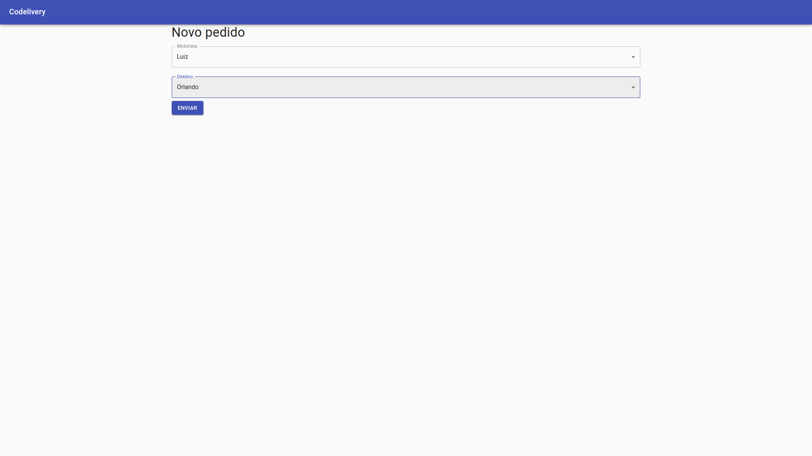
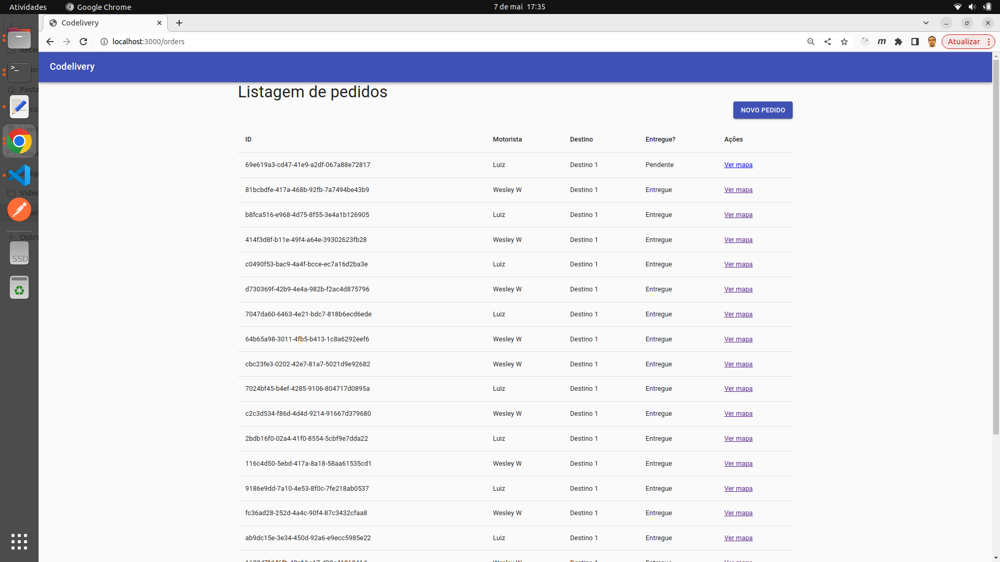
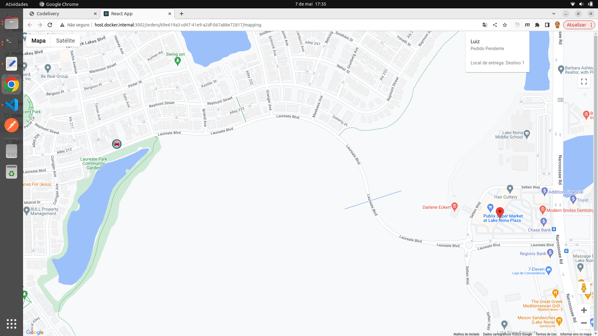
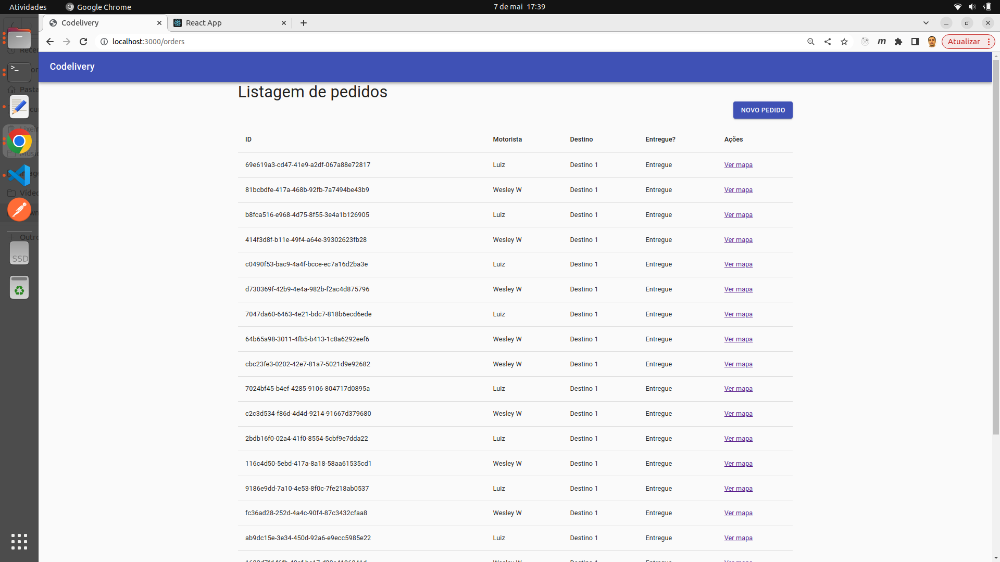

# Maratona Full Cycle - Codelivery - Part III

O projeto consiste em:

- Um sistema de monitoramento de veículos de entrega em tempo real.

Requisitos:

- Uma transportadora quer fazer o agendamento de suas entregas;
- Ela também quer ter o feedback instantâneo de quando a entrega é realizada;
- Caso haja necessidade de acompanhar a entrega com mais detalhes, o sistema deverá informar, em tempo real, a localização do motorista no mapa.

Dinâmica do sistema:

1. A aplicação Order (React/Nest.js) é responsável pelas ordens de serviço (ou pedidos) e vai conter a tela de agendamento de pedidos de entrega. A criação de uma nova ordem de serviço começa o processo para que o motorista entregue a mercadoria;

2. A aplicação Driver (Go) é responsável por gerenciar o contexto limitado de motoristas. Neste caso, sua responsabilidade consiste em disponibilizar os endpoints de consulta;

3. Para a criação de uma nova ordem de serviço, a aplicação Order obtém de Driver os dados dos motoristas. Neste caso, REST é uma opção pertinente, porque a comunicação deve ser a mais simples possível;

4. Após criar a nova ordem de serviço, Order notifica a aplicação Mapping (Nest.js/React) via RabbitMQ de que o motorista deve iniciar a entrega. Mapping é a aplicação que vai exibir no mapa a posição do motorista em tempo real. A aplicação Simulator (Go) também é notificada sobre o início da entrega e começa a enviar para a aplicação Mapping as posições do veículo;

5. Ao finalizar a entrega, a aplicação Mapping notifica via RabbitMQ a aplicação Order de que o produto foi entregue e a aplicação altera o status da entrega de Pendente para Entregue.

## Tecnologias

Nesta terceira versão, foi concluído o desenvolvimento local. Posteriormente, serão adicionadas as tecnologias de integração contínua, deploy e observabilidade.

- Backend
  - Golang
  - TypeScript
  - Nest.js
  - RabbitMQ
  - MySQL
- Frontend (Single Page Application (SPA))
  - React

## Formatos de Comunicação

- REST
- Sistema de mensageria (RabbitMQ)
- WebSockets

Utiliza-se um mecanismo de comunicação entre backend e frontend para entregar os resultados em tempo real para o usuário final. No caso de Mapping, há dois casos de comunicação: 1. Via filas; 2. Via WebSockets.

#### WebSockets

- WebSockets é uma forma de estabelecer uma conexão persistente entre cliente e servidor, ou seja, mantém-se uma conexão aberta para o envio e recebimento de mensagens, sem a necessidade de realizar requests o tempo todo, como é feito com HTTP. Essa característica é fundamental para se trabalhar com tempo real.

  - Como iniciar a comunicação?

    - É feita uma requisição HTTP normal com o prefixo ws:// ou wss:// para conexão segura, ao invés de http://. Uma vez que a requisição HTTP é feita, é solicitado, no momento de enviar para o servidor, um upgrade para WebSockets. A partir do momento que acontece o upgrade, é mantida, então, uma conexão TCP bidirecional, onde é possível enviar e receber informações entre o cliente e o servidor.

  - Como funciona a comunicação?

    - WebSockets segue um padrão de comunicação de Pub/Sub (Publisher/Subscriber). É aberto um canal ou tópico em que o Publisher publica a mensagem para o tópico e um ou mais Subscribers consomem a mensagem desse tópico.

### Mapping

- Mapping é composto por duas aplicações responsáveis pelo rastreamento em tempo real dos motoristas via geolocalização no mapa, aonde é exibido o ponto de partida, o destino e todo o trajeto do motorista até a entrega do pedido.
- A idéia principal é receber as informações de localização do entregador e apresentar no mapa em tempo real. Para tanto, o backend permanece consumindo a localização do entregador através de uma fila. Após receber a posição, o backend abre um canal de comunicação via WebSocket e replica os dados recebidos nesse canal.
- Ao mesmo tempo, no frontend, utiliza-se o React para acessar esse canal, obter as informações e exibir no mapa a localização do entregador em tempo real.

- Vejamos 3 possíveis cenários de comunicação com Mapping:

#### Criar Pedido

- A partir da criação de um novo pedido, os dados de Order são publicados no RabbitMQ. Então, as aplicações Simulator e Mapping são notificadas.
- A aplicação Simulator, a cada novo pedido, começa a enviar os dados de latitude e longitude via RabbitMQ para a aplicação Mapping fazer o rastreio do veículo no mapa.
- A aplicação Mapping, quando notificada da criação de um novo pedido, inclui em sua base de dados as informações para poder gerenciar no mapa o pedido que está sendo rastreado.

#### Rastrear Pedido

- Mapping conta com uma aplicação de backend (Nest.js) e frontend (React). Então, quando o simulador enviar latitude e longitude, o backend vai estar conectado no RabbitMQ para receber essas informações.
- Na seqüência, os dados recebidos pelo backend são enviados para o frontend através de WebSockets.

#### Atualizar Status de Entrega

- No momento em que o motorista chega em seu destino, o que acontece?
- Em determinado momento, a aplicação Simulator publica uma informação via RabbitMQ para a aplicação Mapping saber que o motorista chegou.
- Então, Mapping atualiza o pedido em sua base de dados com o status de Entregue. Uma vez que tenha feito isso, Mapping publica uma mensagem no RabbitMQ para a aplicação Order também alterar na sua base de dados o status do pedido como Entregue.
- Assim, é de responsabilidade da aplicação Mapping a organização do status do pedido no sistema.

### Execução

#### Driver

1. Dentro do diretório driver, executar o comando: `docker-compose up -d`;

2. Para entrar no container, executar o comando: `docker-compose exec goapp_driver bash`;

3. Para rodar a aplicação e subir o servidor HTTP, executar o comando: `go run driver.go`;

#### Simulator

4. Dentro do diretório simulator, executar o comando: `docker-compose up -d`;

5. Para entrar no container, executar o comando: `docker-compose exec goapp_simulator bash`;

6. Para rodar a aplicação e conectar no RabbitMQ, executar o comando: `go run simulator.go`;

#### Order

7. Dentro do diretório micro-order, executar o comando: `docker-compose up`;

#### Mapping

8. Dentro do diretório micro-mapping/backend, executar o comando: `docker-compose up`;

9. Dentro do diretório micro-mapping/frontend, executar o comando: `docker-compose up`;

#### Order

10. Acessar a aplicação: `localhost:3000/orders`;

11. Clicar em Novo Pedido;

12. Selecionar Motorista e Destino;

13. Clicar Enviar;

14. Um novo pedido é criado (ID `69e619a3-cd47-41e9-a2df-067a88e72817`) como Pendente;

15. Clicar Ver mapa;

16. Ao chegar no destino, voltar à tela de Listagem de pedidos, atualizar a página e verificar o pedido (ID `69e619a3-cd47-41e9-a2df-067a88e72817`) como Entregue;

