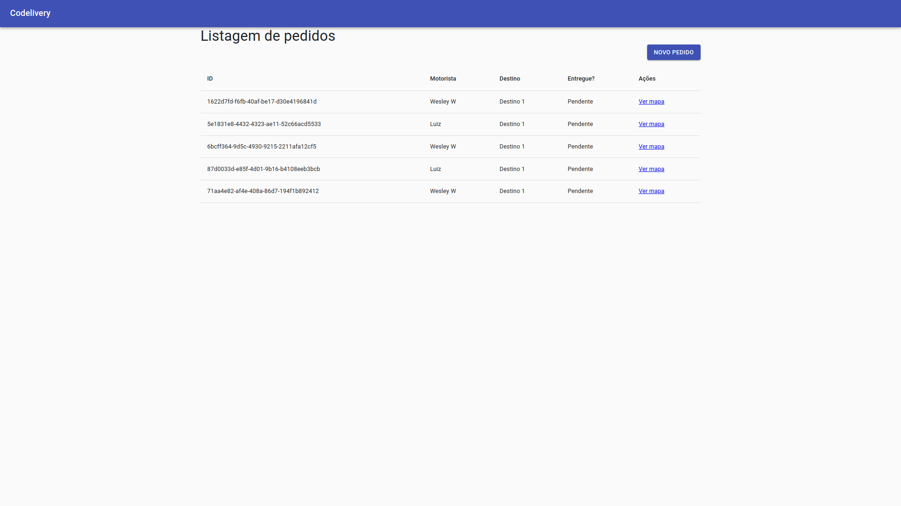

# Maratona Full Cycle - Codelivery - Part III

O projeto consiste em:

- Um sistema de monitoramento de veículos de entrega em tempo real.

Requisitos:

- Uma transportadora quer fazer o agendamento de suas entregas;
- Ela também quer ter o _feedback_ instantâneo de quando a entrega é realizada;
- Caso haja necessidade de acompanhar a entrega com mais detalhes, o sistema deverá informar, em tempo real, a localização do motorista no mapa.

#### Que problemas de negócio o projeto poderia resolver?

- O projeto pode ser adaptado para casos de uso onde é necessário rastrear e monitorar carros, caminhões, frotas e remessas em tempo real, como na logística e na indústria automotiva.

Dinâmica do sistema:

1. A aplicação _Order_ (_React_/_Nest.js_) é responsável pelas ordens de serviço (ou pedidos) e vai conter a tela de agendamento de pedidos de entrega. A criação de uma nova ordem de serviço começa o processo para que o motorista entregue a mercadoria;

2. A aplicação _Driver_ (_Go_) é responsável por gerenciar o contexto limitado de motoristas. Neste caso, sua responsabilidade consiste em disponibilizar os _endpoints_ de consulta;

3. Para a criação de uma nova ordem de serviço, a aplicação _Order_ obtém de _Driver_ os dados dos motoristas. Neste caso, REST é uma opção pertinente, porque a comunicação deve ser a mais simples possível;

4. Após criar a nova ordem de serviço, _Order_ notifica a aplicação _Mapping_ (_Nest.js_/_React_) via _RabbitMQ_ de que o motorista deve iniciar a entrega. _Mapping_ é a aplicação que vai exibir no mapa a posição do motorista em tempo real. A aplicação _Simulator_ (_Go_) também é notificada sobre o início da entrega e começa a enviar para a aplicação _Mapping_ as posições do veículo;

5. Ao finalizar a entrega, a aplicação _Mapping_ notifica via _RabbitMQ_ a aplicação _Order_ de que o produto foi entregue e a aplicação altera o _status_ da entrega de Pendente para Entregue.

## Tecnologias

#### Operate What You Build

- Nesta terceira versão, é concluído o desenvolvimento local. Posteriormente, serão adicionadas as tecnologias de integração contínua, _deploy_ e observabilidade.

  - Backend
    - Golang
    - TypeScript
    - Nest.js
    - RabbitMQ
    - MySQL
  - Frontend (Single Page Application (SPA))
    - React

## Formatos de Comunicação

- _REST_
- Sistema de mensageria (_RabbitMQ_)
- _WebSockets_

Utiliza-se um mecanismo de comunicação entre _backend_ e _frontend_ para entregar os resultados em tempo real para o usuário final. No caso de _Mapping_, há dois casos de comunicação: 1. Via filas; 2. Via _WebSockets_.

### WebSockets

- _WebSockets_ é uma forma de estabelecer uma conexão persistente entre cliente e servidor, ou seja, mantém-se uma conexão aberta para o envio e recebimento de mensagens, sem a necessidade de realizar requests o tempo todo, como é feito com _HTTP_. Essa característica é fundamental para se trabalhar com tempo real.

#### Como iniciar a comunicação?

- É feita uma requisição _HTTP_ normal com o prefixo `ws://` ou `wss://` para conexão segura, ao invés de `http://`. Uma vez que a requisição _HTTP_ é feita, é solicitado, no momento de enviar para o servidor, um upgrade para _WebSockets_. A partir do momento que acontece o _upgrade_, é mantida, então, uma conexão _TCP_ bidirecional, onde é possível enviar e receber informações entre o cliente e o servidor.

#### Como funciona a comunicação?

- _WebSockets_ segue um padrão de comunicação de _Pub_/_Sub_ (_Publisher_/_Subscriber_). É aberto um canal ou tópico em que o _Publisher_ publica a mensagem para o tópico e um ou mais _Subscribers_ consomem a mensagem desse tópico.

### Mapping

- _Mapping_ é composto por duas aplicações responsáveis pelo rastreamento em tempo real dos motoristas via geolocalização no mapa, aonde é exibido o ponto de partida, o destino e todo o trajeto do motorista até a entrega do pedido.
- A idéia principal é receber as informações de localização do entregador e apresentar no mapa em tempo real. Para tanto, o _backend_ permanece consumindo a localização do entregador através de uma fila. Após receber a posição, o _backend_ abre um canal de comunicação via _WebSocket_ e replica os dados recebidos nesse canal.
- Ao mesmo tempo, no _frontend_, utiliza-se o _React_ para acessar esse canal, obter as informações e exibir no mapa a localização do entregador em tempo real.

- Vejamos 3 possíveis cenários de comunicação com _Mapping_:

#### Criar Pedido

- A partir da criação de um novo pedido, os dados de _Order_ são publicados no _RabbitMQ_. Então, as aplicações _Simulator_ e _Mapping_ são notificadas.
- A aplicação _Simulator_, a cada novo pedido, começa a enviar os dados de latitude e longitude via _RabbitMQ_ para a aplicação Mapping fazer o rastreio do veículo no mapa.
- A aplicação _Mapping_, quando notificada da criação de um novo pedido, inclui em sua base de dados as informações para poder gerenciar no mapa o pedido que está sendo rastreado.

#### Rastrear Pedido

- _Mapping_ conta com uma aplicação de _backend_ (_Nest.js_) e _frontend_ (_React_). Então, quando o simulador enviar latitude e longitude, o _backend_ vai estar conectado no _RabbitMQ_ para receber essas informações.
- Na seqüência, os dados recebidos pelo _backend_ são enviados para o _frontend_ através de _WebSockets_.

#### Atualizar Status de Entrega

- No momento em que o motorista chega em seu destino, o que acontece?
- Em determinado momento, a aplicação _Simulator_ publica uma informação via _RabbitMQ_ para a aplicação _Mapping_ saber que o motorista chegou.
- Então, _Mapping_ atualiza o pedido em sua base de dados com o _status_ de Entregue. Uma vez que tenha feito isso, _Mapping_ publica uma mensagem no _RabbitMQ_ para a aplicação _Order_ também alterar na sua base de dados o _status_ do pedido como Entregue.
- Assim, é de responsabilidade da aplicação _Mapping_ a organização do _status_ do pedido no sistema.

### Execução

#### Driver

1. Dentro do diretório _driver_, executar o comando: `docker-compose up -d`;

2. Para entrar no _container_, executar o comando: `docker-compose exec goapp_driver bash`;

3. Para rodar a aplicação (e subir o servidor _HTTP_), executar o comando: `go run driver.go`;

#### Simulator

4. Dentro do diretório _simulator_, executar o comando: `docker-compose up -d`;

5. Para entrar no _container_, executar o comando: `docker-compose exec goapp_simulator bash`;

6. Para rodar a aplicação (e conectar no _RabbitMQ_), executar o comando: `go run simulator.go`;

#### Order

7. Dentro do diretório _micro-order_, executar o comando: `docker-compose up`;

#### Mapping

8. Dentro do diretório _micro-mapping/backend_, executar o comando: `docker-compose up`;

9. Dentro do diretório _micro-mapping/frontend_, executar o comando: `docker-compose up`;

#### Order

10. Acessar a aplicação: `localhost:3000/orders`;

11. Clicar em `Novo Pedido`;

12. Selecionar _Motorista_ e _Destino_;

13. Clicar `Enviar`;

14. Um novo pedido é criado (_ID_ `69e619a3-cd47-41e9-a2df-067a88e72817`) como _Pendente_;

15. Clicar `Ver mapa`;

16. Ao chegar no destino, voltar à tela de `Listagem de pedidos`, atualizar a página e verificar o pedido (_ID_ `69e619a3-cd47-41e9-a2df-067a88e72817`) como _Entregue_;

